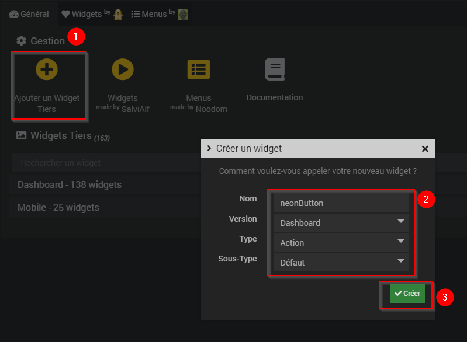

# Widget nooCheckBox

## A récupérer sous /jeedom_widgets/nooCheckBox/cmd.action.other.nooCheckBox.html

## Création du widget

Depuis le plugin Pimp My Jeedom :

- Depuis l'onglet 'Général', sélectionner le bouton 'Ajouter un Widget Tiers'
- Saisir le nom nooCheckBox, la version Dashboard, le type Action et le Sous-Type Défaut puis valider avec le bouton 'Créer'

- Dans la zone de texte 'Edition', coller le code du fichier cmd.action.other.nooCheckBox.html
- Sélectionner le bouton 'Sauvegarder'

## (facultatif) Création d'un virtuel avec commande action

- Si vous souhaitez associer le widget à une commande existante, cette étape n'est pas nécessaire
- Sinon, si vous souhaitez créer un nouveau nooCheckBox :
	- Créer un virtuel depuis le plugin Virtuel (Plugin -> Programmation -> Virtuel)
	- Ajouter une commande info Etat et de sous-type Binaire
  - Ajouter une commande action à associer à la commande info Etat
  - Saisir pour valeur 'not(#[monObjet][monNooCheckBox][Etat]#)'

## association du widget à la commande action

Depuis le plugin Pimp My Jeedom :

- Sélectionner le bouton 'Appliquer sur'
- Cocher les commandes de type Action souhaitées
- Enregistrer les commandes avec le bouton 'Valider'

- La liste des commandes associées au widget sont visibles dans la partie 'Commandes liées'
- Une prévisualisation basée sur le premier virtuel associé est visible

## (facultatif) Paramètres de la commande associée au widget

De nombreux paramètres sont possibles pour personnaliser les virtuels et obtenir des rendus différents

		type : type de la checkbox (par défaut slideOne), valeurs possibles : slideOne, slideTwo, slideThree, roundedOne, roundedTwo, squaredOne, squaredTwo, squaredThree, squaredFour
		color1 : couleur de la checkbox (par défaut '#27ae60')
		color2 : couleur de dégradé de la checkbox (par défaut '#27ae60')
		arrowColor : couleur de la coche pour les types roundedTwo, squaredTwo, squaredThree, squaredFour
		squaredBorder : forme carrée du contour de la checkbox pour les types sliderOne, sliderTwo, roundedOne, roundedTwo (par défaut : 0), valeurs possibles : 0 : non /1 : oui
		blinkingOn : provoque un clignotement de l'état On pour les types roundedOne et squaredOne (par défaut 0), 0 : non clignotant, 1 : clignotant
		blinkingOnSpeed : vitesse de clignotement avec unité à préciser (par défaut '1s' pour une seconde), ex : '0.5s', '1s', '2s', '500ms', ..
		(inactif) textOn : texte en état ON pour le type slideThree (par défaut 'ON')
		(inactif) textOff : texte en état OFF pour le type slideThree (par défaut 'OFF')

## Ajout dans un Design

	- Depuis un Design, ajouter l'équipement ou le virtuel et suivez les étapes suivantes :
		- Clic droit, Sélectionnez 'Edition'
		- Clic droit, puis sélectionnez 'Ajouter équipement'
		- Sélectionner l'équipement souhaité
		- Sélectionner Valider
		- Rafraichir la page : le widget nooNeonButton est visible dans le Design

Pensez au café pour les nuits blanches de codage ;) https://www.paypal.com/cgi-bin/webscr?cmd=_donations&business=noodom.fr%40gmail.com&currency_code=EUR&source=url
