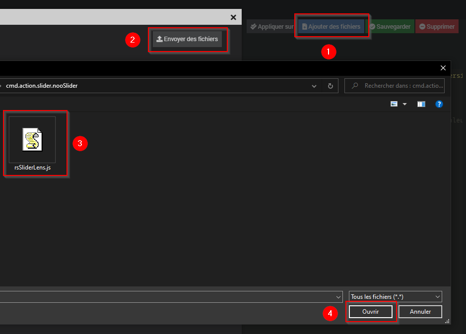

# Widget nooClockTimePicker

## A récupérer sous /jeedom_widgets/nooClockTimePicker/cmd.action.slider.nooClockTimePicker.html

## Création du widget

Depuis le plugin Pimp My Jeedom :

- Depuis l'onglet 'Général', sélectionner le bouton 'Ajouter un Widget Tiers'
- Saisir le nom nooClockTimePicker, la version Dashboard, le type Action et le Sous-Type Curseur puis valider avec le bouton 'Créer'

- Dans la zone de texte 'Edition', coller le code du fichier cmd.action.slider.nooClockTimePicker.html

- Sélectionner le bouton 'Ajouter des fichiers', puis 'Envoyer des fichiers', ajouter le fichier /cmd.action.slider.nooClockTimePicker/jquery-clock-timepicker.min.js et fermer la fenêtre

- Sélectionner le bouton 'Sauvegarder'

>**Note** : Le widget peut évidemment être créé de façon classique comme un widget tiers sans le plugin Pimp my Jeedom
> - Sélectionner le menu Outil -> Widgets,
> - Sélectionner Code, puis Nouveau
> - Saisir le nom nooClockTimePicker, la version Dashboard, le type Action et le Sous-Type Curseur puis valider avec le bouton 'Créer'
> - Dans la zone de texte 'Edition', coller le code du fichier cmd.action.slider.nooClockTimePicker.html
> - Sélectionner le bouton 'Sauvegarder'

## (facultatif) Création d'un virtuel avec commande info et commande action Curseur

- Si vous souhaitez associer le widget à une commande existante, cette étape n'est pas nécessaire
- Sinon, si vous souhaitez créer un nouveau nooClockTimePicker :
	- Créer un virtuel depuis le plugin Virtuel (Plugin -> Programmation -> Virtuel)
	- Dans ce virtuel, ajouter une commande info et de sous-type Numérique
		- Ce champ texte peut être modifié par scénario avec la commande event : la mise à jour de la valeur sera alors immédiate sur le design
	- Dans le virtuel, ajouter une commande action et de sous-type Curseur
  - Associer la commande info à cette commande action

## association du widget à la commande action

Depuis le plugin Pimp My Jeedom :

- Sélectionner le bouton 'Appliquer sur'
- Cocher les commandes de type Action souhaitées
- Enregistrer les commandes avec le bouton 'Valider'

- La liste des commandes associées au widget est visible dans la partie 'Commandes liées'
- Une prévisualisation basée sur le premier virtuel associé est visible

## (facultatif) Paramètres de la commande associée au widget

De nombreux paramètres sont possibles pour personnaliser les virtuels et obtenir des rendus très différents

		width : taille de la popup de saisie (par défaut 200)
		afternoonHoursInOuterCircle : affiche les heures > 12h à l'extérieur (par défaut 0)
		alwaysSelectHoursFirst : affiche les heures en premier, sinon affiche les minutes si clic dessus (par défaut 1)
		autosize : ajuste la taille du champ de saisie au contenu (par défaut 0)
		hideUnselectableNumbers : cache les valeurs non saisissables suivant min/max (par défaut 0)
		min : affiche l'heure minimale autorisée, peut être négatif (par défaut '00:00')
		max : affiche l'heure maximale autorisée (par défaut '23:59')
		modeSwitchSpeed : délai d'animation entre le passage heures/minutes en ms (par défaut 500)
		precision : pas de sélection des minutes, valeurs possibles : 1, 5, 10, 15, 30, 60 (par défaut 1)
  		buttonTextColor : couleur du texte des boutons sur mobile (par défaut '#0797FF')
		clockFaceColor : couleur de fond de l'horloge (par défaut '#EEEEEE')
		clockInnerCircleTextColor : couleur des nombres intérieurs (par défaut '#888888')
		clockInnerCircleUnselectableTextColor : couleur des nombres intérieurs non sélectionnables (par défaut '#CCCCCC')
		clockOuterCircleTextColor : couleur des nombres extérieurs (par défaut '#000000')
		clockOuterCircleUnselectableTextColor : couleur des nombres intérieurs non sélectionnables (par défaut '#CCCCCC')
		hoverCircleColor = couleur du cercle des nombres au passage de la souris (par défaut '#DDDDDD')
		popupBackgroundColor : couleur de fond de la popup (par défaut '#FFFFFF')
		popupHeaderBackgroundColor : couleur de l'entête sur mobile (par défaut '#0797FF')
		popupHeaderTextColor : couleur du texte de l'entête sur mobile (par défaut '#FFFFFF')
		selectorColor : couleur du cercle de sélection (par défaut '#0797FF') 
		selectorNumberColor : couleur du nombre sélectionné (par défaut '#FFFFFF')
		borderRadius : angle des coins du fond de la popup (par défaut '5' pour '5px')
		border : css personnalisé pour le bord de l'horloge (par défaut 'solid white 1px')
		fontName : définition de la fonte des boutons pour mobile (Par défaut 'Arial',)
		clockOuterCircleFontSize : taille des valeurs du cercle extérieur (par défaut 24)
		clockInnerCircleFontSize : taille des valeurs du cercle intérieur (par défaut 12)
		buttonFontSize : taille des boutons OK/Cancel pour mobile (par défaut 20)
		okButtonText = Texte du bouton de validation (par défaut 'OK')
		cancelButtonText = Texte du bouton d'annulation (par défaut 'Cancel')
                
		duration = autorise une saisie supérieure à 23h, pour une durée (par défaut 0)
		durationNegative : autorise une saisie négative, pour une durée (par défaut 0)
		onlyShowClockOnMobile = affiche l'horloge seulement sur mobile (par défaut 0)
		separator = définit le séparateur (par défaut ':')
		useDurationPlusSign = affiche le signe + (par défaut 0)

## Ajout dans un Design

	- Depuis un Design, ajouter l'équipement ou le virtuel et suivez les étapes suivantes :
		- Clic droit, Sélectionnez 'Edition'
		- Clic droit, puis sélectionnez 'Ajouter équipement'
		- Sélectionner l'équipement souhaité
		- Sélectionner Valider
		- Rafraichir la page : le widget nooClockTimePicker est visible dans le Design
		
Pensez au café pour les nuits blanches de codage ;) https://www.paypal.com/cgi-bin/webscr?cmd=_donations&business=noodom.fr%40gmail.com&currency_code=EUR&source=url
